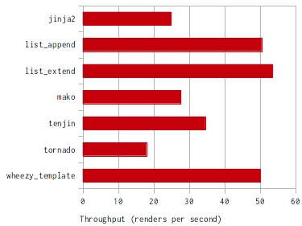
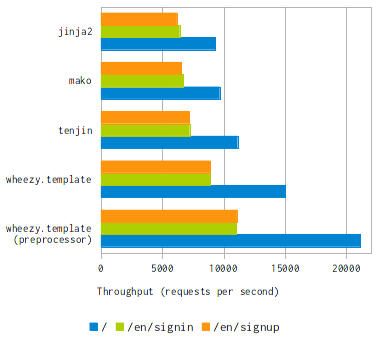

Examples
========

Before we proceed let's setup a `virtualenv`_ environment::

    $ virtualenv env
    $ env/bin/easy_install wheezy.template

Big Table
---------

The big table demo compares `wheezy.template` with other template
engines in terms of how fast a table with 10 columns x 1000 rows can be
generated::

    @require(table)
    <table>
        @for row in table:
        <tr>
            @for key, value in row.items():
            <td>@key!h</td><td>@value!s</td>
            @end
        </tr>
        @end
    </table>

Install packages used in benchmark test::

    env/bin/easy_install -O2 jinja2 mako tenjin \
      tornado wheezy.html wheezy.template

Download `bigtable.py`_ source code and run it (Intel Core 2 Quad CPU Q6600 @
2.40GHz × 4; Kernel Linux 3.2.0-2-686-pae; Debian Testing; Python 2.7.3)::

    $ env/bin/python bigtable.py
    jinja2                         40.22ms  24.86rps
    list_append                    19.85ms  50.39rps
    list_extend                    18.71ms  53.46rps
    mako                           36.19ms  27.63rps
    tenjin                         28.97ms  34.52rps
    tornado                        55.91ms  17.89rps
    wheezy_template                19.99ms  50.02rps

Real World
----------

There is real world example available in the `wheezy.web`_ package. It can be found
in the `demo.template`_ application. The application has a few screens: home, sign
up, sign in, etc. The content implementation is available for jinja2, mako,
tenjin, wheezy.template and for wheezy.template with preprocessor.

The throughtput was captured using apache benchmark (concurrecy level 500,
number of request 100K)::

                        /        /en/signin    /en/signup
    jinja2              9339     6422          6196
    mako                9681     6720          6567
    tenjin              11138    7233          7203
    wheezy.template     15023    8898          8900
    wheezy.template     21144    11027         11087
    (preprocessor)

Environment specification::

* Client: Intel Core 2 Quad CPU Q6600 @ 2.40GHz × 4, Kernel 3.2.0-3-686-pae
* Server: Intel Xeon CPU X3430 @ 2.40GHz x 4, Kernel 3.2.0-3-amd64, uwsgi 1.2.4
* Debian Testing, Python 2.7.3, LAN 1 Gb.

.. _`virtualenv`: http://pypi.python.org/pypi/virtualenv
.. _`bigtable.py`: https://bitbucket.org/akorn/wheezy.template/src/tip/demos/bigtable/bigtable.py
.. _`wheezy.web`: http://pypi.python.org/pypi/wheezy.web
.. _`demo.template`: https://bitbucket.org/akorn/wheezy.web/src/tip/demos/template
